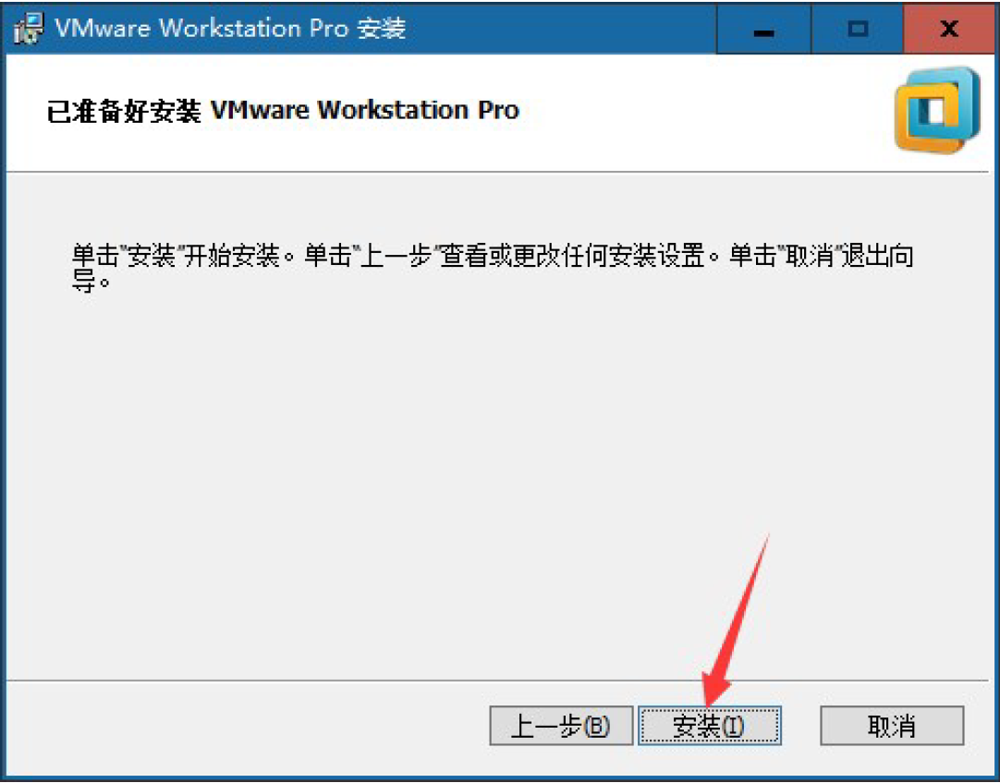
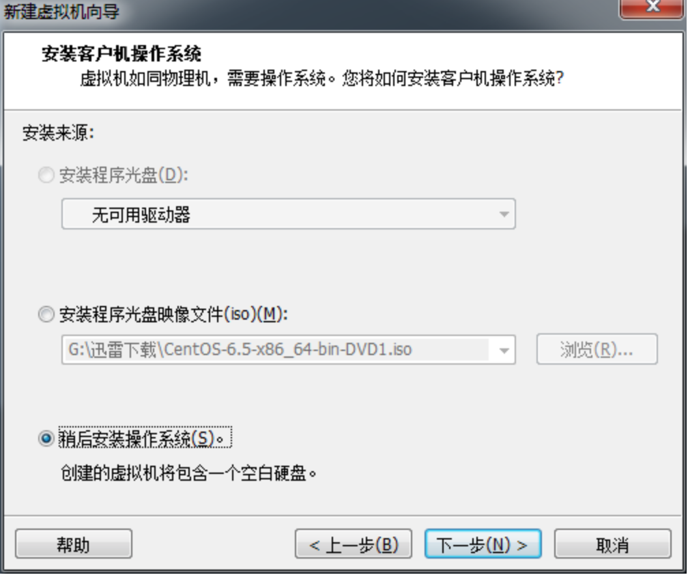
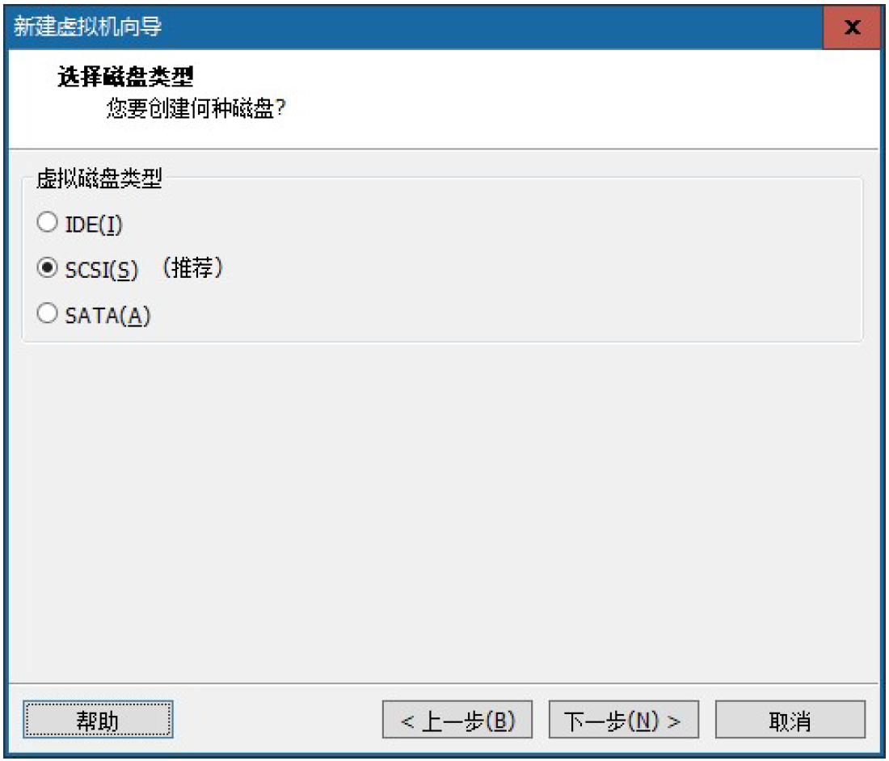

# 运维概述与Linux系统安装

# 学习目标

1、了解运维的基本概念

2、了解企业的运行模式

3、了解操作系统发展史以及作用

4、掌握虚拟机配置以及CentOS系统安装

# 一、运维概述

## 1、运维岗位收入情况


数据来源：[职友集](https://www.jobui.com/salary/?cityKw=北京&jobKw=运维)

## 2、运维岗位的定义

**什么是运维？**

在技术人员（写代码的）之间，一致对运维有一个开玩笑的认知：运维就是修电脑的、装网线的、==背锅==的岗位。

其实不然，运维是一个非常广泛的定义，==在不同的公司不同的阶段有着不同的职责与定位==，如果以operation（运维英文）字面的含义去理解，认为就是敲几行操作命令的工作，那就错了。

**Devops，运维开发**

对于初创公司，运维工程师的工作可能需要从申请域名开始，购买/租用服务器,上架，调整网络设备的设置，部署操作系统和运行环境，部署代码，设计和部署监控，防止漏洞和攻击等等。

对于大型的公司，对于运维工作的要求越来越高，也催生了更细化的运维分工：从大的方向，可以分为==网站运维，基础运维、系统运维、网络运维、数据库运维、IT 运维、运维开发、大数据运维、云计算运维、运维安全、运维架构师、运维专家==等方向。


## 3、运维的诞生

从最早的网管开始，九十年代初期，互联网欠发达的时候，还少有=="服务器"==的概念，电脑价格昂贵，大多数人并不具备在家上网的条件，网吧应运而生。

网吧的电脑、猫等设备需要进行日常维护，于是“网管”岗位应运而生，这就是早期运维的雏形。

## 4、90年代初网吧图


## 5、运维行业背景

① 从行业角度来看，随着==中国互联网的高速发展(BAT)==、网站规模越来越来大、架构越来越复杂，对专职网站运维工程师、网站架构师的要求会越来越急迫，特别是对有经验的优秀运维人才需求量大，==而且是越老越值钱==。

② 从个人角度，运维工程师技术含量及要求会越来越高，同时也是对公司应用、架构最了解最熟悉的人，==越来越得到重视==。

③ 运维是一个融合多学科（网络、系统、开发、安全、应用架构、存储等）的综合性技术岗位，给运维工程师提供了==一个很好的个人能力与技术的发展空间==。

④ 运维工作的相关经验将会变得非常重要，而且也将成为个人的核心竞争力，==优秀的运维工程师具备很好的各层面问题的解决能力及方案提供、全局思考的能力等==。

⑤ 由于运维岗位所接触的知识面非常广阔，==更容易培养或发挥出个人某些方面的特长或爱好==，如内核、网络、开发、数据库等方面，可以做得非常深入精通、成为这方面的专家。

⑥ ==当前国内外对运维人才的需求非常迫切，运维工程师的薪资也水涨船高==，与研发、测试等技术部门持平，甚至超出。

# 二、企业运行模式

## 1、铁三角

==铁三角 = 产品 + 研发 + 运维==

流程走向：产品设计 → 项目研发 → 项目测试 → 项目上线→系统运维


## 2、部门与部门职责

产品部门（PM、UI、UE，3-5 个）：设计产品的需求，确定需要做的项目的功能和细节问题

研发部门（5-7 个）：根据产品部门/测试部门提供的项目模块需求进行编程

测试部门（2 个左右即可）：对于研发部门提供的代码进行运行测试，检查是否存在bug和一些需要改善的体验

运维部门（3-4 个）：负责项目环境部署、上线、架构的搭建等等

## 3、上线与生产

**上线**：==上线是指将项目从测试环境转到对用户开放的过程。内测/公测 → 开服==

**生产**：==上线之后的运行阶段，称之为叫做生产。(有流水阶段)==

在项目的从无到有的过程中，可以将其分为两个阶段：研发阶段、生产阶段。

> 运维在其中承担了承上启下的作用，衔接了研发阶段与生产阶段，属于其中最重要的一环。

## 4、网站的概念

简单地说，网站是一种沟通工具，人们可以通过网站来发布自己想要公开的资讯，或者利用网站来提供相关的网络服务。人们可以通过网页浏览器来访问网站，获取自己需要的资讯或者享受网络服务。

```powershell
扩展：了解网站的分类
根据网站所用编程语言分类：例如ASP/JSP/PHP网站等；
根据网站的用途分类：例如门户网站（综合网站）、行业网站、娱乐网站等
根据网站的功能分类：例如单一网站（企业网站）、多功能网站（网络商城）等
根据网站的持有者分类：例如个人网站、商业网站、政府网站、教育网站等
根据网站的商业目的分类：营利型网站（行业网站、论坛）、非营利性型网站（企业网站、政府网站、教育网站）
根据网站的面向终端的分类：Web网站（电脑端或PC端）和 WAP网站（手机端）
```

## 5、网站运行模式（重点）


> DNS 作用：将域名转换成IP 地址。

从上图中可以看出如果一个网站项目需要正常的运行，则需要的前提条件有：

① 域名（方便用户记忆）

② 需要对域名和ip 的关系进行关联（DNS 服务器）

③ 服务器

④ 服务器的项目运行环境

## 6、几个重要概念

**==① 域名==**

就是在浏览器地址栏中输入的那一串字母和数字的组合，例如：www.baidu.com，这个就是域名，域名主要是方便用户记忆。

> 问：www.baidu.com 这个域名是几级的域名？二级域名，看域名的级别只要看有几个"."，日常所说的注册域名指的是注册顶级域名（一级）】

**==② 服务器==**

就是给用户提供服务的机器（电脑）。服务器可以分为四大类：塔式服务器、机式服务器、刀片服务器、柜式服务器。


> 问题一：普通台式机/笔记本能否充当服务器来使用？

标准的回答：如果从提供服务的实现角度来考虑的话的确是可以，但是如果要想稳定、高效的提供服务，则在这个角度考虑家用电脑和笔记就无法取代服务器地位。

家用台式机/笔记本从系统角度来看，一般都会使用Windows 系统（易用），并不适合作为服务器来使用。

家用台式机/笔记本硬件和专门的服务器相比标准不统一。

> 问题二：服务器有哪些特性？
>
> 高性能特性 + 标准化统一特性。

**==③ IP地址==**

形式ipv4（常见）、ipv6（不考虑）。Ipv4 形式：x.x.x.x，x 有取值范围（第1 位x取值1-255，从第二位开始0-255）。由于资源有限为了保证全球这么多台电脑都可以使用，ip 可以分为公网/外网ip 和私网/内网ip 地址。

>  0.0.0.0，表示任意地方，anywhere...

**==④ 公网==**

www（万维网），全世界都可以互相访问的网。 红警+游戏对战平台局域网/内网/私网：在某个单元内部（家庭/教室/公司）能够进行互相访问的网络。

## 7、服务器的重要结构组成

家用电脑组成： CPU、主板、内存条、显卡、硬盘、电源、风扇、网卡、显示器、机箱、键盘鼠标等等。

### 1）CPU

CPU是电脑的大脑，如下图所示：


CPU发展史：


32 位CPU：最大的内存寻址地址2^32，大约4G的大小。

> 聊聊2的23次方怎么算？
>
> 1024B=1KB 	1024KB=1MB  1024MB=1GB
>
> 2^32B  = 2^32 / 1024 /1024 /1024 = 4GB

### 2）内存


内存也是电脑必需组件之一。

### 3）风扇


### 4）电源


### 5）硬盘


硬盘的作用：存储数据。

硬盘可以分为机械硬盘、固态硬盘。

### 6）主板


主要的作用：

自身包含了一些集成电路，负责各个不同的功能和数据通信。

主板上有很多空的插槽，插槽的作用在于扩展外部的硬件设备。

# 三、操作系统概述

## 1、计算机发展史

第一台计算机是1946 年2 月14 日诞生日，第一台名称ENIAC。体积一间屋子的大小，重量高达28t。

第一代：1946 – 1958  => 12 年 （电子管）


第二代：1958 – 1964 => 6 年 （晶体管）


第三代：1964 – 1970 => 6 年 （集成电路）


第四代：1970 – 至今 （大规模集成电路）

## 2、计算机组成

CPU、内存、风扇、硬盘、显示器、主板、电源、声卡、网卡、显卡、鼠标、键盘等

## 3、计算机资源（重点）

计算机资源分为2 部分：==硬件资源、软件资源==

硬件：一般硬件是指计算机的物理组成，由==真实（看得见，摸得着）==的设备组成的

软件：软件==一般是指应用程序==，应用程序程序是由开发人员去按照编程语言的特定的规则去

编写的程序。除了上述的应用程序之外，==操作系统也属于软件资源的范畴，它属特殊的软件==。

> 问题：为什么在打开一个应用程序之后（吃鸡游戏），当玩家在敲击键盘和移动鼠标的时候里
>
> 面人物会有对应的行为表现呢？

答：用户敲击键盘/移动鼠标（硬件操作） → 硬件的驱动（软件资源） → 操作系统（软件） → 硬件支持（cpu） → 操作系统（软件） → 驱动（显卡驱动） → 显示在屏幕上（硬件）

## 4、操作系统

常见操作系统有：==Windows、MacOS、Linux==。

Windows：其是微软公司研发的收费操作系统（闭源）。

Windows 系统体系分为两类：用户操作系统、Server 操作系统。

用户操作系统：win 95、win 98、win NT、win Me、win xp、vista、win7、win8、win10。


MacOS：==其是由苹果公司开发的一款收费（变相收费，买电脑送系统）操作系统==。该系统从

终端角度来看分为：watch OS、IOS、MacOS。其表现突出的地方：底层优化实现的很好、安

全性要更加高点（闭源）。


Linux：==Linux 是目前全球使用量最多的服务器操作系统（开源）==。其体系很强大，其分支有

很多（数不胜数），其目前主要的分支有：RedHat（红帽）、Debian、乌班图（ubuntu）、CentOS

等等。其在世界范围最大的使用分支是安卓。


闭源：不开放源代码，用户是没有办法看到软件的底层实现（闭源≠收费）。

开源：表示开放源代码（开源≠免费）。

## 5、为什么需要Linux操作系统

> 问题：windows 既然可以使用傻瓜式的方式进行操作，例如使用ctrl+c 表示复制，ctrl+v 表示粘贴等，为什么还需要使用/学习Linux 系统？

① 性能问题，windows 服务器操作系统不如Linux 高；

② 稳定性问题：

底层架构：Linux 更加稳定，其开机时间可以达到好几年不关机；

开源：因为开源，人人都可以看到源代码，就可以为其提供自己的补丁，补丁可以提高 稳定性和安全性；

③ 安全性问题：

Linux 操作系统，相对于windows 操作系统要更加安全；

④ 远程管理方面：

Windows 不及Linux 操作高效。

⑤ 服务器价格昂贵的，需要对资源进行充分利用，充分把计算机资源用到项目上（访问并发、性能），而不是把资源浪费在图形化界面或者方便程度上；

# 四、Linux发展史

## 1、Linux前身

1968 年 Multics 项目

==MIT、Bell 实验室、美国通用电气有限公司==走到了一起，致力于开发Multics 项目。到后期由于开发进度不是很好，MIT 和Bell 实验室相继离开这个项目的开发，最终导致项目搁浅。当时在开发Multics 项目的时候，实验室中有一个开发成员开发了一款游戏（travel space：遨游太空），因为两个实验室相继离开项目开发，导致这名开发人员没法玩游戏，后来他提议组织人员重新在Multics 项目之上重新的开发，也就出现了1970 年的Unix。当时Unix 操作系统是使用的汇编语言（机器语言）开发的。

1970 年（Unix 元年，时间戳） Unix 诞生 1970.1.1 00:00:00（时间戳，是指1970 年1.1 零时零分零秒到现在的秒数）

1973 年 用C 语言重写Unix

因为汇编语言有一个最大的局限性：对于计算机硬件过于依赖。导致移植性不好，所以后期在1973 年使用了C 语言对其进行重新开发。

1975 年 Bell 实验室允许大学使用Unix。

1975 年，Bell 实验室允许大学使用Unix 操作系统用于教学作用，而不允许用于商业用途。

## 2、Linux诞生

人物 Linus

 

Linux 的开发作者，Linux 之父，李纳斯·托瓦兹。Linux 诞生时是荷兰在校大学生。

1991 年 0.0.1 版本

李纳斯当时学校使用的就是Unix 操作系统，然后其对系统的底层代码进行了修改，放到了学校为学生开放的网站上，原先他把文件命名写成了Linus’s Unix，后期网络管理发现之后觉得这个名字不好，自己手动的将名字改成Linux。随后其他同学下载之后发现这个版本还是挺好用的，随后都把自己代码贡献给李纳斯。

1992 年 0.0.2 版本

1994 年 1.0 版本

2003 年 2.6 版本

上述所提及的版本号并不是分支版本，而是指Linux 的内核版本。

## 3、Linux 的含义

广义：广义上的Linux 是指由Linux内核衍生的各种Linux发行版本。

狭义：由Linus 编写的一段内核代码。

> 注意：以后提及到的Linux 都是广义上的Linux

## 4、开源文化（了解）

Linux 是一款开源的操作系统。

>  什么是开源？答：所谓开源就是指开放项目源代码

人 物 Stallman 斯特曼：开源文化的倡导人。

 

1983 年 GNU 计划 格奴计划 GNU/Linux

1985 年 FSF 基金会

1990 年 Emacs、GCC（c 语言的编译器）、程序库

1991 年 Stallman 去找Linus，商谈让Linux 加入其开源计划（GNU 计划）

1992 年 GNU/Linux

## 5、Linux特点

开放性（开源）、多用户、多任务、良好的用户界面、优异的性能与稳定性

多用户多任务：

单用户：一个用户，在登录计算机（操作系统），只能允许同时登录一个用户；

单任务：一个任务，允许用户同时进行的操作任务数量；

多用户：多个用户，在登录计算机（操作系统），允许同时登录多个用户进行操作；

多任务：多个任务，允许用户同时进行多个操作任务；


==Windows 属于：单用户、多任务。==

==Linux 属于：多用户、多任务。==

## 6、Linux分支

分支：Linux 分支有很多，现在比较有名的redhat、ubuntu、debian、centos（Community Enterprise

Operating System）、suse 等等。

CentOS6.5

CentOS7.5

# 五、Linux系统安装

## 1、Linux系统安装方式

目前安装操作系统方式有2 种：真机安装、虚拟机安装。

真机安装：使用真实的电脑进行安装，像安装windows 操作系统一样，真机安装的结果就是替换掉当前的windows 操作系统；

虚拟机安装：通过一些特定的手段，来进行模拟安装，并不会影响当前计算机的真实操作系统；

>  如果是学习或者测试使用，强烈建议使用虚拟机安装方式。

## 2、虚拟机概念

什么是虚拟机？

虚拟机，有些时候想模拟出一个真实的电脑环境，碍于使用真机安装代价太大，因此而诞生的一款可以模拟操作系统运行的软件。

虚拟机目前有2 个比较有名的产品：vmware 出品的vmware workstation、oracle 出品的virtual Box。

## 3、虚拟机的安装

第一步：双击打开VMware安装程序


第二步：进行下一步安装


第三步：同意许可协议，单击下一步


第四步：根据需要决定是否需要更改软件的安装位置（建议放置于除C盘以外任意盘符下）


第五步：更改成功后，单击确定，下一步继续安装：


> 注意：所有软件的安装目录最好在安装的时候是空的

第六步：用户体验设置，如下图所示，单击下一步继续安装


第七步：快捷方式设置，单击下一步继续安装


第八步：单击安装按钮



第九步：安装结束后，单击完成按钮


==注意事项：最重要的地方，在安装完之后需要检查，检查虚拟机软件是否有安装2 个虚拟网卡==


> Windows7与Windows10可能显示网络名称有所不同，但是底部虚拟机网络是一致的。

## 4、Linux系统环境部署

Linux系统版本选择：CentOS6.5 x64，【镜像一般都是CentOS*.iso文件】

> 问题：为什么不选择最新版的7.x 版本？
>
> 6.x 目前依然是主流
>
> 6.x 的各种系统操作模式是基础
>
> 7.x 实际上也支持大多数6.x 的操作形式

官网：https://www.centos.org/ ，从官网下载得到的镜像文件：


第一步：新建虚拟机，点击=="文件"==菜单，选择=="新建虚拟"==选项，选择=="自定义"==点击下一步：


第二步：选择兼容性，默认即可，单击下一步：


第三步：选择镜像文件的时候选择“稍后安装操作系统”，点击下一步




第四步：设置虚拟机的名称（名称将会后期出现在左侧）和设置虚拟系统的安装位置


第五步：CPU设置，提示：根据自身电脑配置选择CPU设置，一般默认即可，1*1


第六步：分配虚拟机内存


第七步：选择虚拟机网络类型，默认选择NAT即可。

NAT：配置好之后windows 即可和虚拟机进行互相通信，但是教室内的其他同学是访问不了的，只有自己可以访问虚拟机中的操作系统。

桥接：配置好之后其他同学也可以访问你的虚拟机操作系统。


第八步：后续默认的步骤，直接下一步





安装完毕后，单击完成：


## 5、CentOS系统安装配置

第一步：选择CentOS系统安装镜像【*.iso文件】

第二步：开启虚拟机，进行系统安装


> 注意：如果开机之后鼠标点进去虚拟机出不来，则可以按下组合快捷键"Ctrl + Alt"

第三步：如果启动之后出现类似提示框（不是错误框）则勾选不再提示，并且确定即可：


> 特别注意：如果在启动时候出现下述错误，则说明电脑没有开启cpu 的虚拟化，如果需要开启，则需要重启计算机，并且在开启的时候进入主板的BIOS 设置开启虚拟化，然后保存设置重启电脑：


第四步：选择升级/安装已经存在的系统（通过↑ 或 ↓方向键进行选择），确认后，按下回车


第五步：在检测到光盘（Disc）之后选择跳过完整性检测直接进行安装


随后提示不支持的硬件，忽略直接下一步


第六步：单击下一步

 

第七步：选择安装过程中使用的语言


第八步：选择键盘类型，美国英语式


第九步：选择存储设备类型


第十步：对磁盘进行空白盘的初始化操作，选择"是，忽略所有的数据"


第十一步：设置网卡自动连接，依次应用 –> 关闭 -> 下一步


第十二步：设置时区，默认亚洲/上海


第十三步：设置密码，设置好了之后下一步


第十四步：使用全部的磁盘空间来安装Linux 系统，点击下一步


第十五步：选择安装的Linux 类型


第十六步：选择开发->开发工具，前面复选框==打钩 √==，点击下一步


等待软件包的安装


第十七步：等待完成，单击重新引导


重新引导之后点击"前进"


在协议许可界面选择同意，然后点击前进：


第十八步：创建普通用户帐号（可选），然后点击前进


第十九步：设置时间，设置好之后前进


第二十步：关于kdump，之后点击完成


设置完成后，登陆：


如果需要使用非列出的用户进行登录则点击其他，否则双击列出的用户名即可，随后输入密码，使用root账号登陆之后的提示：


登陆成功后，桌面如下图所示：


