# Linux基础命令（上）

# 学习目标

1、了解VMware备份的两种方式

2、能说出快照与克隆的区别

3、了解Linux系统文件

4、掌握Linux常用命令

# 一、备份操作系统

在VMware中备份的方式有2 种：快照或克隆。

## 1、快照

快照：又称还原点，就是保存在拍快照时候的系统的状态（包含了所有的内容），在后期的时候随时可以恢复。

> 注意：侧重在于短期备份，需要频繁备份的时候都可以使用快照，做快照的时候虚拟机中操作系统一般处于开启状态

**==快照==：使用VMware实现快照，具体操作步骤，参考如下**

第一步：选择==虚拟机==菜单，点选==快照==中的==拍摄快照==

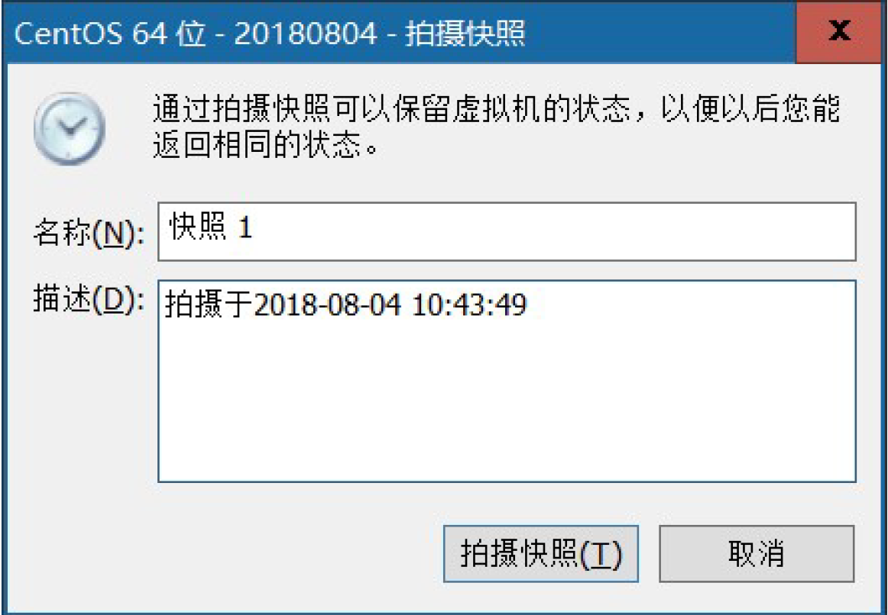

在对话框中填写基本的信息，之后点击==拍摄快照==即可。

第二步：对于快照进行管理（恢复、删除）

对快照的管理需要在"虚拟机" -> "快照" -> "快照管理器"中进行管理

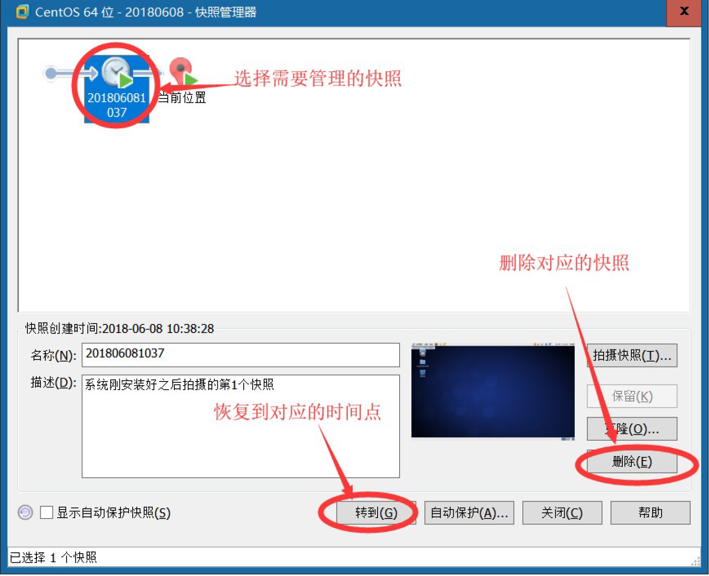

## 2、克隆

克隆：就是复制的意思。

> 注意：克隆侧重长期备份，做克隆的时候是必须得关闭（了解）

**==克隆==：使用VMware实现克隆，具体操作步骤，参考如下**

先关机 –> 右键需要克隆的虚拟机 –> 管理 –> 克隆

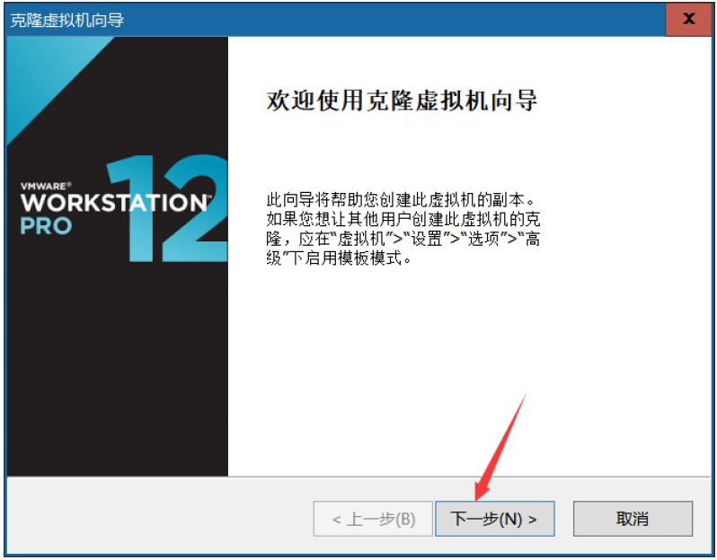

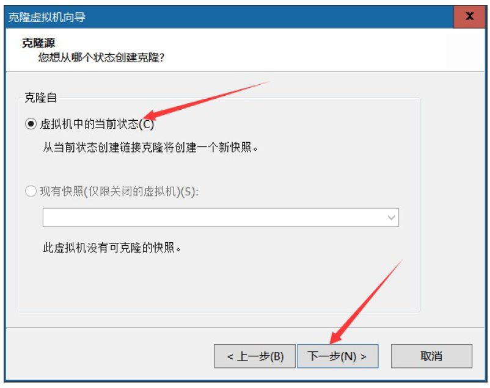


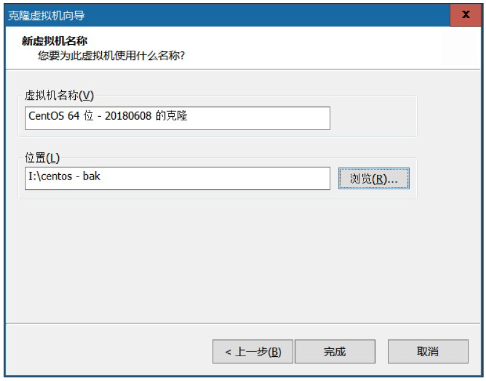

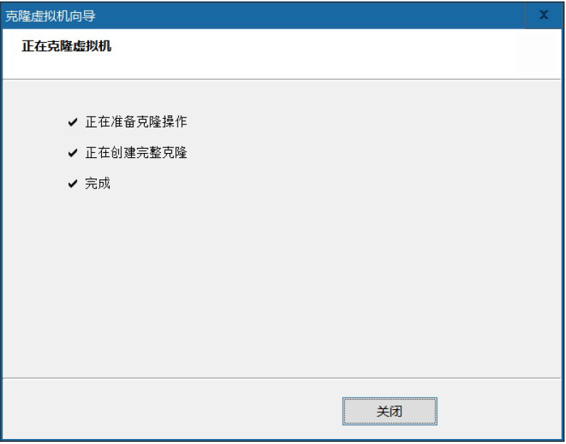

克隆好的服务器相关密码帐号等信息与被克隆的系统一致。但是，克隆出来的机器网卡不能直接启动使用，需要配置。

## 3、快照与克隆的区别

克隆与快照的最大的区别：==克隆之后是2 台机器，而快照之后依旧是1 台机器（影子系统）。后期的危险操作前建议使用快照。==

# 二、Linux系统文件

## 1、文件与文件夹（目录）

**==什么是文件？==**

文件可以分为一般文件和可执行文件。

一般文件特点其打开（编辑器打开）后会看到里面有内容，或者可以往其中写内容。

可执行文件在Windows 下一般为exe、msi、bat 等后缀，其特点就是双击之后可以直接运行。

**==什么是文件夹？==**

用于存储文件（当然也可以存储文件夹）的夹子称之为文件夹。

**==为什么要先讲文件？==**

① 日常运维工作中，有近一半以上的工作内容、精力其实都是对文件的操作。

② Linux 本身也是一个基于文件形式表示的操作系统。

```powershell
小常识：在Linux系统中，一切皆文件
在windows 是文件的，在Linux 下同样也是文件；
在windows 不是文件的，在Linux 下也是以文件的形式存储的（进程等）；
```

日常学习中和日常工作中，对于文件的操作的都有哪些种类？

创建文件、删除文件、修改文件、打开文件、复制文件、移动文件、重命名文件等。

## 2、Linux 系统的文件目录结构

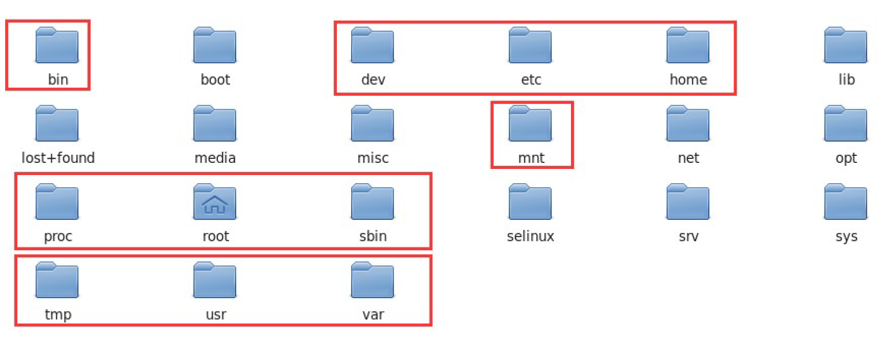

```powershell
bin：全称binary，含义是二进制（逢二进一）。该目录中存储的都是一些二进制文件，文件都是可以被运行的。

dev：device，该目录中主要存放的是外接设备，例如盘、其他的光盘等。在其中的外接设备是不能直接被使用的，需要挂载（类似windows 下的分配盘符）。

etc：该目录主要存储一些配置文件。

home：表示“家”，表示除了root用户以外其他用户的家目录，类似于windows下的User/用户目录。

proc：process，表示进程，该目录中存储的是Linux 运行时候的进程, 此目录下不能建立和删除文件；(某些文件可以修改)。

root：该目录是root 用户自己的家目录。

sbin：全称super binary（shell binary），该目录也是存储一些可以被执行的二进制文件，但是必须得有super 权限的用户才能执行。

tmp：表示“临时”的，当系统运行时候产生的临时文件会在这个目录存着。

usr：存放的是用户自己安装的软件。类似于windows 下的program files。

var：variable（可变的，变量），存放的程序/系统的日志文件的目录。

mnt：当外接设备需要挂载的时候，临时挂载用的设备挂载点；(如磁盘分区，网络共享)
```

后续需要了解的几个目录：

```powershell
boot：系统在启动时需要加载的文件存储目录；

lib：library，函数库目录，专门存储计算机系统在启动时以及其他软件在运行时需要加载的函数库文件；

lost+found：Linux 也很难避免不出现断电、宕机等等情况，如果断电有些文件可能还并没有完全保存好，那么此时对应文件就会存储在该目录中，下次启动时候可以再去使用；
```

# 三、Linux命令入门

## 1、开启终端

问题：后期Linux 服务器都是以纯命令行的形式运行的，那在桌面模式下是否有命令输入的地方？

答：有，可以使用==终端==输入命令，在顶部单击==应用程序==菜单，选择==系统工具==，选择==终端==即可。

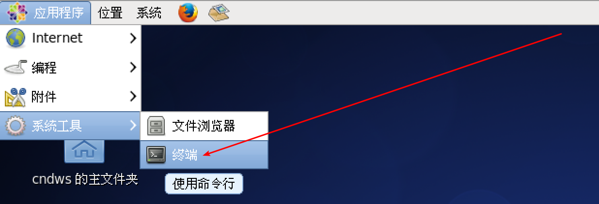

运行结果如下图所示：

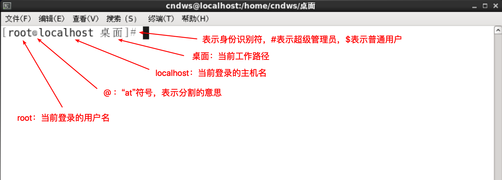

## 2、命令与选项

什么是Linux 的命令？

答：就是指在Linux 终端（命令行）中输入的内容就称之为命令。

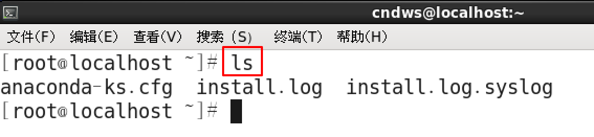

一个完整的命令的标准格式：Linux 通用的格式

==# 命令（空格） [选项]（空格）[参数]==

注意：后期被=="[]"==包裹的表示该项为可选项，可写可不写，具体得看需要一个命令可以包含多个选项。操作对象也可以是多个。

## 3、几个常用命令

### ① **ls命令**

ls（完整写法=>list）列出,列表

==用法一：==# ls

含义：列出当前工作路径下的文档名称

示例代码：

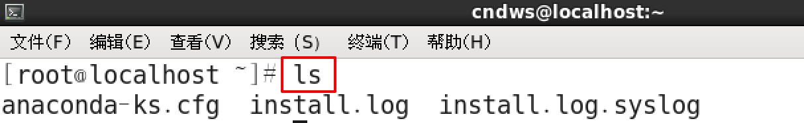

==用法二：==# ls  路径

```powershell
关于路径：路径分为 绝对路径和相对路径。
绝对路径：不管当前工作路径是在哪，目标路径都会从“/”磁盘根下开始。
相对路径：除绝对路径之外的路径称之为相对路径，相对路径得有一个相对物（当前工作）。
只要看到路径以“/”开头则表示该路径是绝对路径，除了以“/”开头的路径称之为相对路径。
../：表示上级目录
./ ：表示当前目录
```

示例代码：

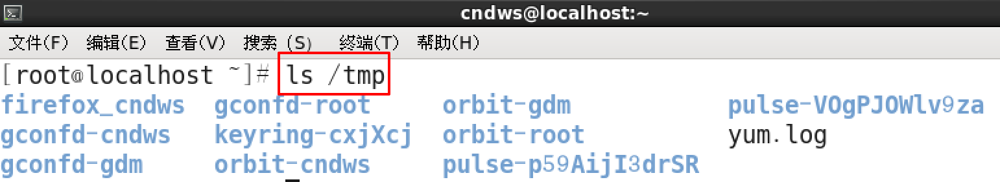

==用法三：==# ls  选项  路径

含义：在列出指定路径下的文件/文件夹的名称，并以指定的格式进行显示。

常见的语法：

\#ls     -l      路径

\#ls     -la    路径 【在Linux 命令语法中，多个选项可以合并写成-abcdef 这种形式】

选项说明：

==-l ：表示list，表示以详细列表的形式进行展示==

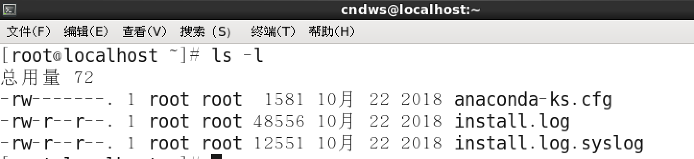

==-a：all，表示显示所有的文件/文件夹（包含了隐藏文件/文件夹）==

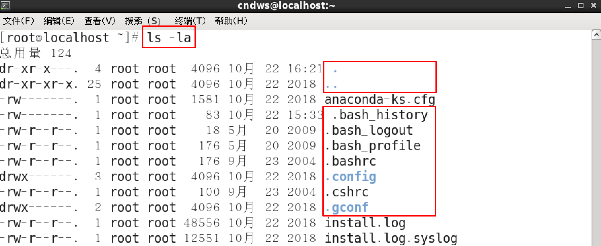

特别说明：

```powershell
在Linux 中隐藏文档一般都是以"."开头，"."表示当前路径，".."表示上级路径（相对当前路径）
注意第一列的第一个字符，上述图中只有一个不是以“d”开头，其他均为“d”打头，该位表示文档类型，“d”表示文件夹，“-”表示是文件

文件&文件夹在ls结果中所表示的颜色是不一样的，文件夹的颜色一般都是蓝色的，文件一般都是黑色的（所说的颜色均是指在终端中的默认颜色）
```

==扩展命令：ll，ll等价于"# ls -l"==

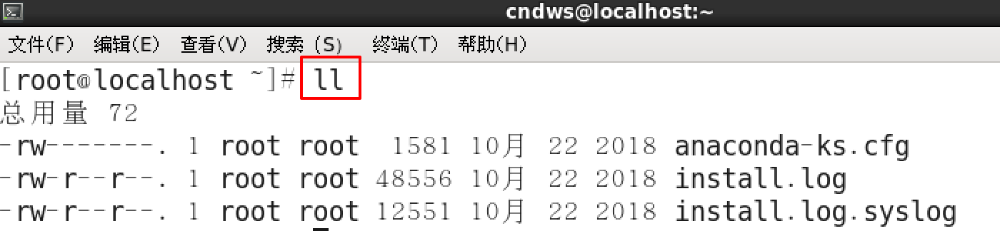

==用法四：== # ls   -lh   路径

含义：列出指定路径下的文档结构，以指定的方式进行显示。

选项说明：

-l：表示以列表的形式进行显示

-h：表示以较高可读性（文档大小）的形式进行展示

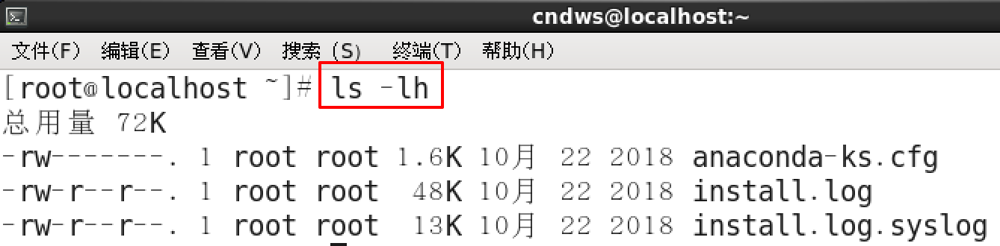

```powershell
需要注意：单位不一定是k，系统会在获取其大小之后为文档找到一个合适的单位，因此单位可是“K”、“M”、“G”、“T”其中之一。
```

### ② pwd命令

用法：# pwd（==print working directory==，打印当前工作目录）

含义：告诉用户当前所在的路径

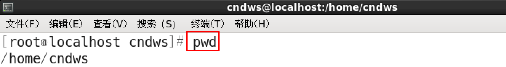

### ③ cd命令

命令： cd （==change directory==，改变目录）

作用：用于切换当前的工作目录的

语法：# cd   [路径]

说明：路径是可以写也可以不写的，但是含义必定是不一样的，写路径的话则表示切换到指定路径，如果不写表示切换到当前登录用户的家目录中。

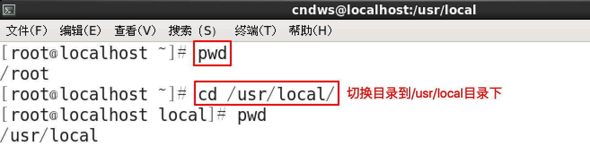

> 特别用法说明：在Linux 中有一个特殊的符号“~”，表示当前用户的家目录，等价于直接cd。
>
> 切换的方式：# cd ~ 【表示切换到当前用户家目录中】


### ④ clear命令

命令： clear

作用：用于清除终端信息（清屏）

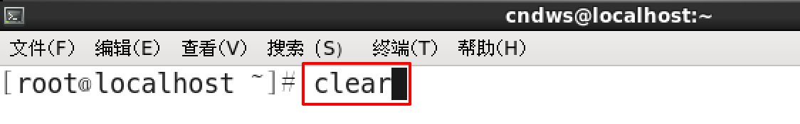

### ⑤ whoami命令

命令： whoami

作用：用户获取当前用户的用户名

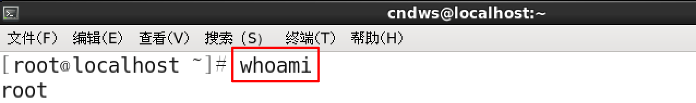

### ⑥ reboot命令

命令： reboot

作用：重启操作系统


###  ⑦ shutdown命令

命令： shutdown

作用：关机命令

用法一：# shutdown   -h    0或now  	       ==立即关机==

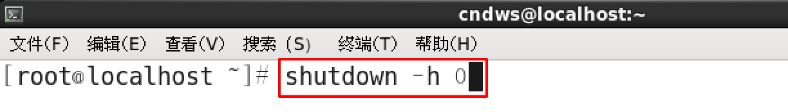

==扩展命令：halt命令==

```powershell
在实际应用中，我们也可以直接使用halt命令进行关机操作。
基本语法：
# halt
以上命令相当于"shutdown  -h   0"，代表立即关机
```

用法二：# shutdown   -h    10   			==延迟关机，10分钟之后关机==

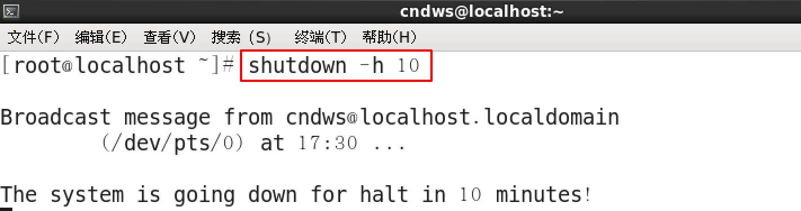

# 四、Linux基本命令

## 1、目录相关命令

在实际应用中，与目录相关的操作主要有两个：创建目录与删除目录

### ① 创建目录

命令： mkdir  (==make directory==，创建目录)

作用：创建目录

语法：# mkdir   路径（需要包含文件夹名称）

==用法一：创建目录==

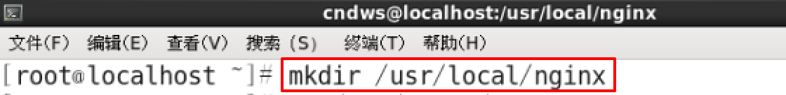

```powershell
特别注意：mkdir命令默认不能隔级创建目录，必须要求要创建的目录所在的目录一定要存在，如果想创建多层不存在的路径，可以使用mkdir -p进行实现。
```

==用法二：递归创建目录==

作用：用于创建多层不存在的路径，主要是补充用法一【-p：表示parents，父母的意思】

语法：# mkdir   -p    路径（需要包含目录名称）

假设/usr/local目录下不存在nginx目录，递归创建/usr/local/nginx/html

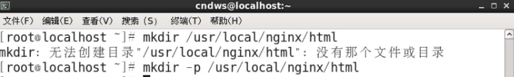

==用法三：同时创建多个目录==

语法：#mkdir   [-p]   路径1   路径2   路径3

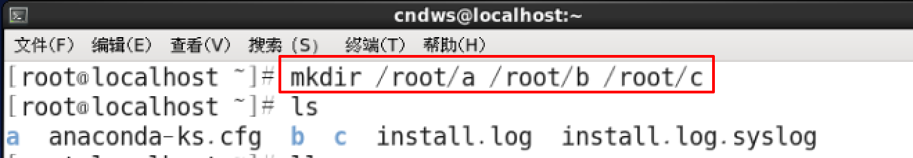

### ② 删除目录

命令： rmdir

作用：删除空目录

语法：# rmdir  路径（需要包含目录名称）

==用法一：删除空目录==

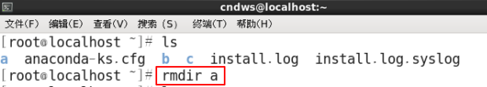

==用法二：同时删除多个空目录==

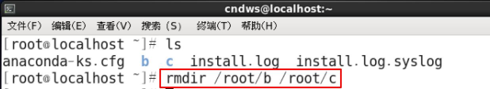

==用法三：递归删除空目录==

语法：# rmdir  -p  路径

作用：首先删除子目录，删除成功后，删除上级目录，直至结束。

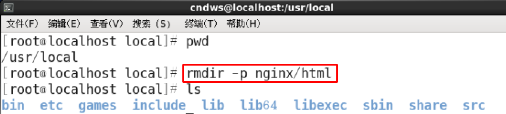

## 2、文件操作

在实际应用中，与文件相关的操作主要有两个：创建文件与删除文件

### ① 创建文件

命令：touch

作用：创建文件

语法：# touch  文件路径    [文件路径2    文件路径3 …]

==用法一：创建readme.txt文件==

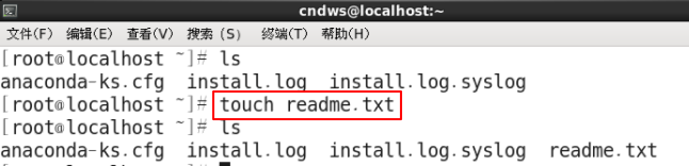

==用法二：同时创建多个文件==

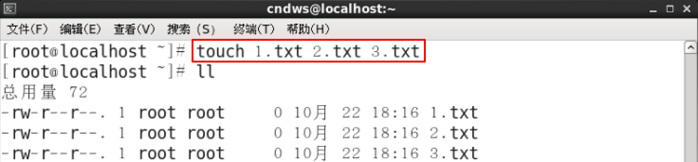

### ② 删除文件

命令：rm

作用：删除文件或文件夹

语法：rm   [-rf]    文件或文件夹路径

选项：-r ：递归删除

​	   -f  ：强制删除，不提示任何信息。操作前一定要慎重！！！

==用法一：删除readme.txt文件==

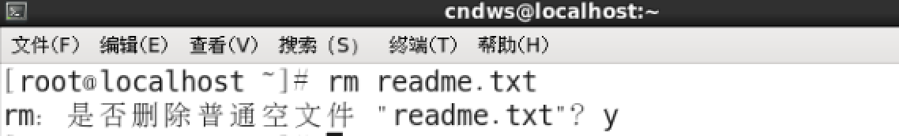

==用法二：递归删除目录==

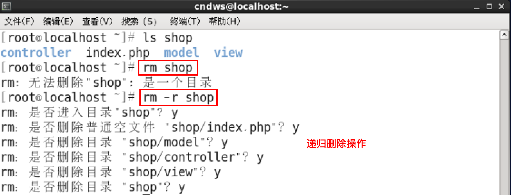

==用法三：强制删除文件或目录==

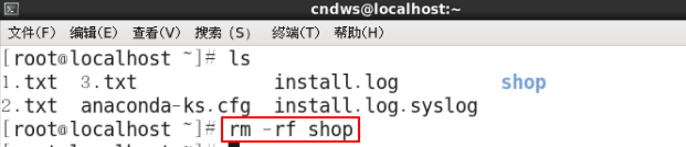

## 3、复制与剪切

### ① 复制操作

命令：cp (copy缩写，复制操作)

作用：复制文件/文件夹到指定的位置

语法：#cp  [-r]   被复制的文档路径 文档被复制到的路径

选项：-r：recursion，递归，表示将文件夹中所有的下属文件/文件夹都复制。如果是使用cp命令来复制文件夹，则-r 就不是选项，而是必须项

> 注意：复制过程中文档的名称是不变的。

示例代码：复制/root/readme.txt到/tmp目录下

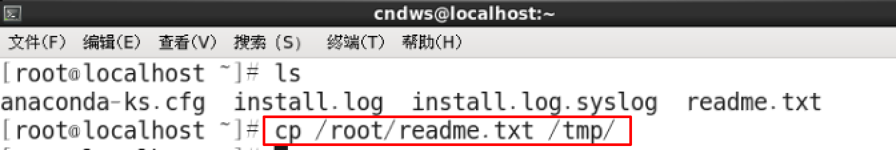

示例代码：复制/root/shop目录到/tmp目录下

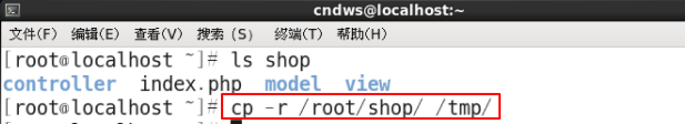

### ② 剪切操作

命令：mv （move，移动，剪切）

作用：移动文档到新的位置

语法：#mv 需要移动的文档路径 需要保存的位置路径

```powershell
mv与cp的区别：
☆ mv 与 cp 命令不一样，不管是针对文件还是针对文件夹都不需要加类似 -r 的选项。
☆ 在移动的过程中文档名称名称是不变的，变的是路径
```

示例代码：

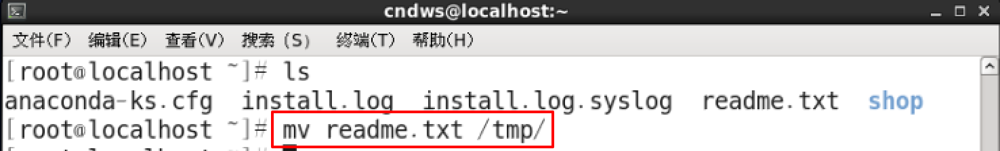

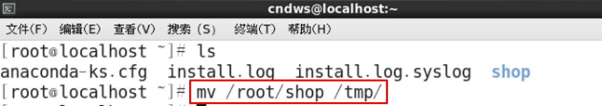

### ③ 重命名操作

在Linux 中重命名的命令也是mv，语法和移动语法一样。区别在于重命名的话一般是路径不变，名称改变。【而移动是名字不变，路径变】 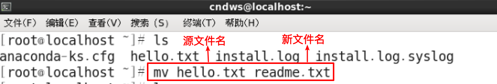

## 4、压缩与解压缩

### ① gzip|bzip2|xz压缩与解压缩命令

gzip|bzip2|xz：压缩单个文件

==☆ gzip命令==

语法一：gzip 需要压缩的文件

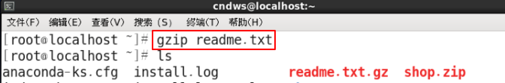

语法二：gzip   file1  file2  同时压缩多个文件

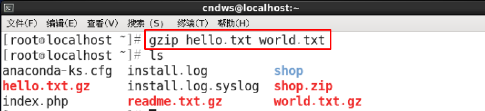

> 压缩速度快，压缩率低，cpu开销比较低

解压：gunzip或者gzip -d

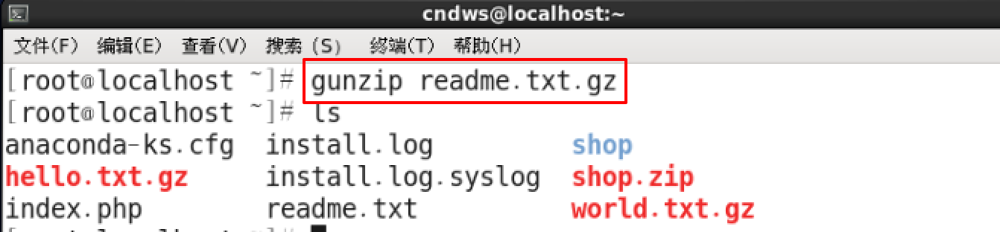

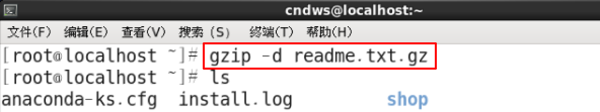

==☆ bzip2命令==

压缩：bzip2  需要压缩的文件

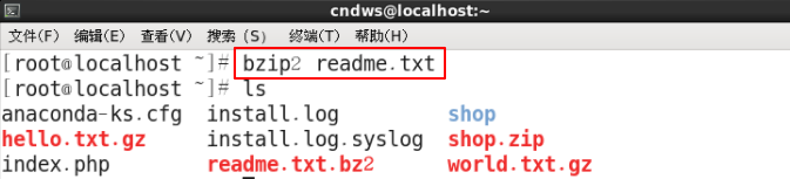解压：bzip2  -d 需要解压的文件

> 压缩速度慢，压缩率高，cpu开销大

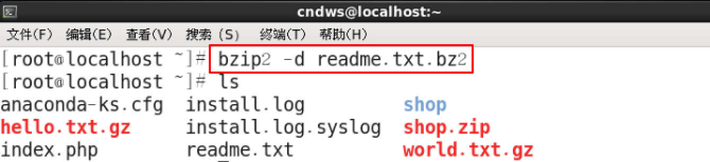

==☆ xz命令==

> 压缩率高，解压速度快，压缩时间较长，cpu消耗相对较大

压缩：xz 需要压缩的文件

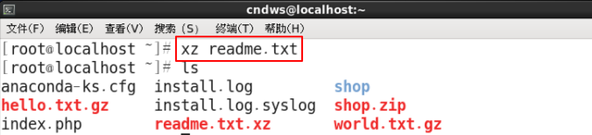

解压：unxz 或者 xz  -d

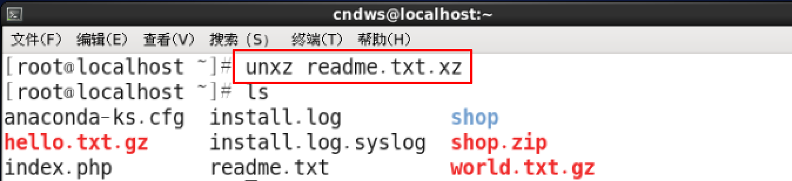

### ② tar打包命令

gzip 、bzip2或xz命令带有多个文件作为参数时，执行的操作是将各个文件独立压缩，而不是将其放在一起进行压缩。这样就无法产生类似于Windows环境下的文件夹打包压缩的效果，为了实现打包压缩的效果，可以使用命令 tar 进行文件的打包操作(archive)，再进行压缩。

tar命令可以将文件打包成文件档案(archive)存储在磁盘/磁带中，打包操作一般伴随压缩操作，也可以使用 tar 命令对打包压缩后的文件解压。

#### 1）打包

==语法：tar  选项   打包文件名    要压缩的文件或目录==

选项：-c，create 创建的意思

​	    -v，可视化的意思，即可以查看创建的过程，可以省略

​	    -f，必选参数，不能省略

​	    -u，更新原压缩包中的文件

​	    -r，向压缩归档文件末尾追加文件

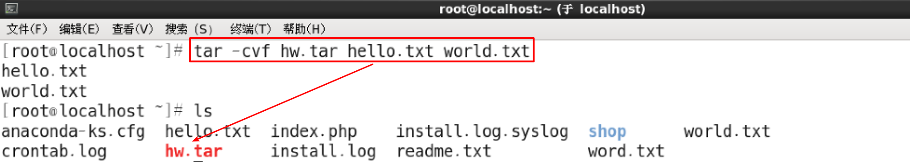

示例代码：这条命令是更新原来tar包hw.tar中hello.txt文件，-u是表示更新文件的意思

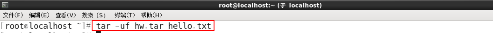

示例代码：这条命令是将readme.txt的文件增加到hw.tar的包里面去。-r是表示增加文件的意思

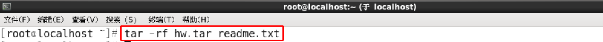

#### 2）打包并压缩

tar 在打包的时候，是支持压缩的，之前讲过的 gzip 、bzip2 、xz 压缩工具都可以在 tar 打包文件中使用。

==语法：tar  选项   打包文件名    要压缩的文件或目录==

选项：-z，压缩为.gz格式

​	    -j，压缩为.bz2格式

​	    -J，压缩为.xz格式

​	    -c，create 创建的意思

​	    -v，可视化的意思，即可以查看创建的过程，可以省略

​	    -f，使用档案名字，切记，这个参数是最后一个参数，后面只能接档案名。==必选参数，不能省略==

示例代码：把hello.txt与world.txt压缩为hw.tar.gz文件

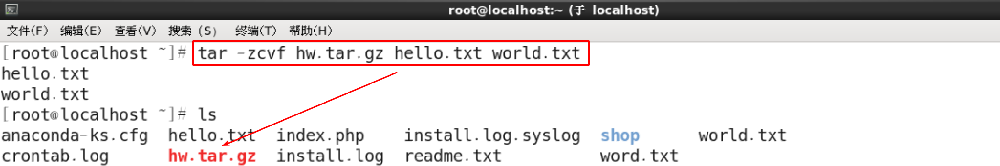

示例代码：把hello.txt与world.txt压缩为hw.tar.xz文件

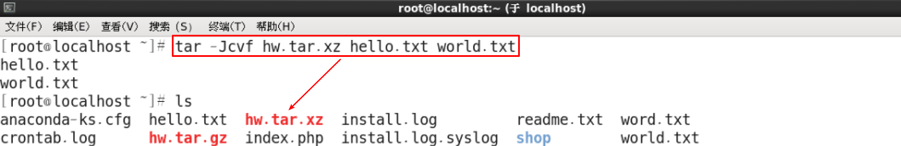

### 3）解压

解压的时候，把压缩命令中的 c 换成 x 即可

示例代码：解压hw.tar.gz文件

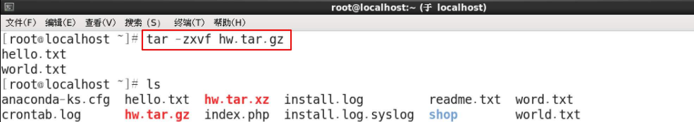

示例代码：解压hw.tar.xz文件

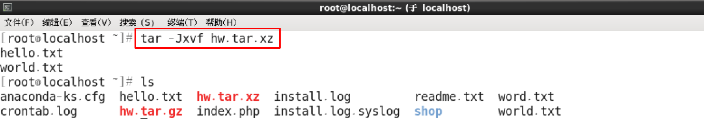

### 4）扩展

使用选项 -tf ，可以查看压缩文件内容，并且都适用以下三种压缩文件

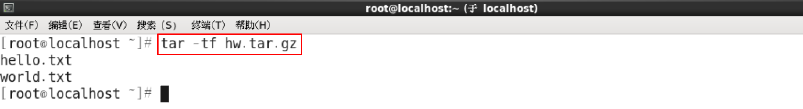

### ③ zip压缩与解压缩（了解）

#### 1）zip压缩

命令：zip

作用：兼容类unix与windows，可以压缩多个文件或目录

语法：# zip   [-r]    压缩后的文件   需要压缩的文件(多个文件)

选项：-r 递归压缩

> 注意：zip压缩默认压缩后的格式就是.zip，当然也可以加后缀.zip，一般都加上

==用法一：文件压缩==


==用法二：文件夹压缩==


#### 2）unzip解压缩

命令：unzip

作用：解压文件

语法：unzip   要解压的压缩文件   [-d]   解压目录

==用法一：解压到当前目录==


==用法二：解压到指定目录==


## 5、输出重定向

场景：一般命令的输出都会显示在终端中，有些时候需要将一些命令的执行结果想要保存到文件中进行后续的分析/统计，则这时候需要使用到的输出重定向技术。

==\>：标准输出重定向 => 覆盖输出，会覆盖掉原先的文件内==

==\>>：追加重定向 => 追加输出，不会覆盖原始文件内容，会在原始内容末尾继续添加==

语法：# `需要执行的有输出的命令`   `输出重定向符号>或>>`   `输出到的文件路径`

> 说明：文件路径中的文件可以是不存在的文件（文件路径要符合touch 创建的要求）

==用法一：输出重定向==

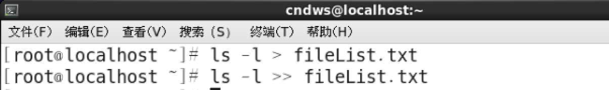

==用法二：echo命令，作用：字符串输出==

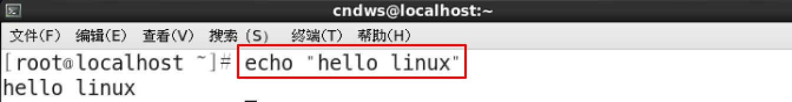

==用法三：使用echo命令向文件中写入自定义内容==

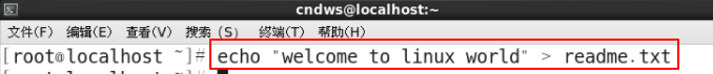


**扩展：标准输入输出**

bash的I/O输入输出：
==标准输入(stdin)    ：键盘上所输入的内容			 	文件描述符	 0==
==标准输出(stdout) ：屏幕上所输出的正确的结果		文件描述符	 1==

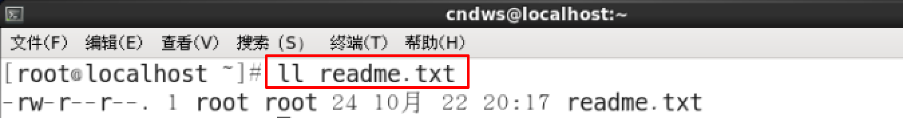

==标准错误(stderr)  ：屏幕上所输出的错误的结果		文件描述符    	 2==

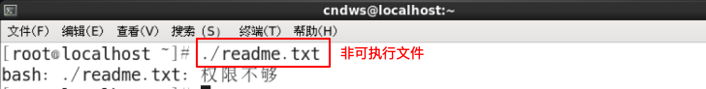

==2> ：标准错误重定向==

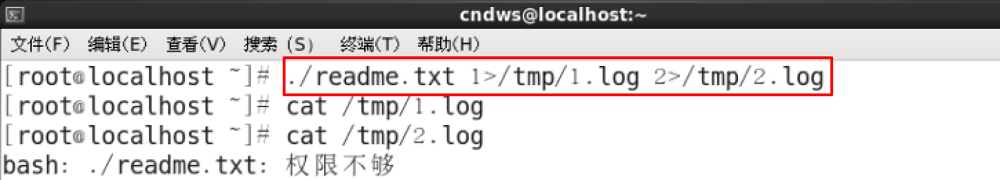

==&> ：标准输出和标准错误重定向==

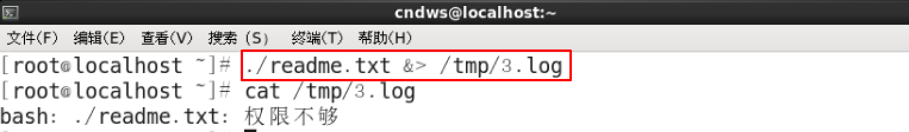

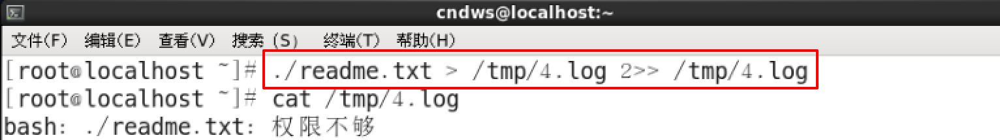

## 6、查看文件内容

### ① 正序查看

命令：cat

作用：正序查看文件内容

语法：# cat  文件名称

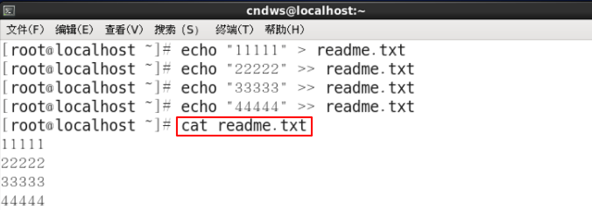

### ② 文件内容合并

> 其实cat方法还有一个非常实用的功能，可以进行文件内容合并

语法：#cat  待合并的文件路径1  待合并的文件路径2  ….  文件路径n  >  合并之后的文件路径

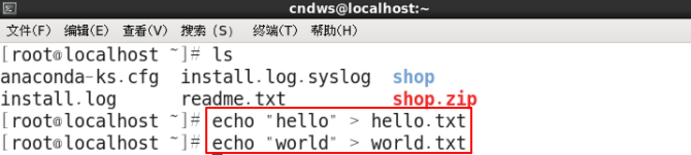

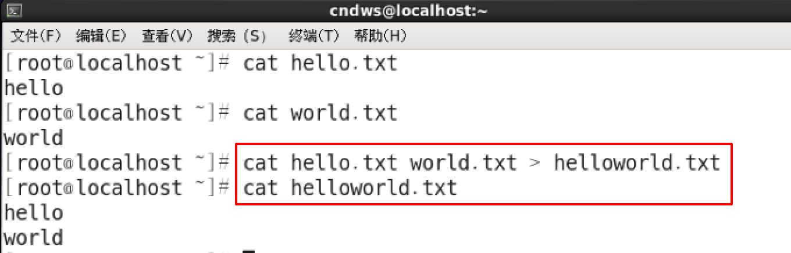

### ③ 倒序查看

命令：tac

作用：倒序查看文件内容

语法：# tac  文件名称

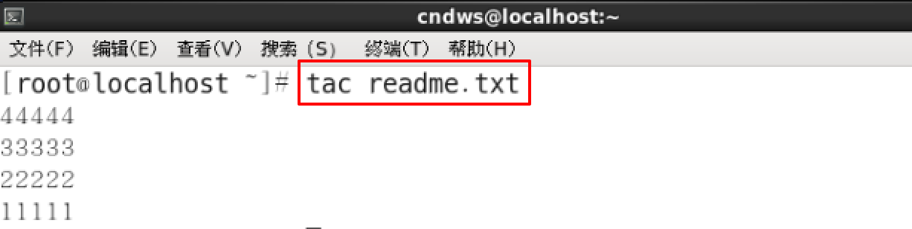

## 7、帮助

```powershell
求帮助方法：
help 简约
内部：help 命令
外部：命令 --help or -h

man  详细帮助，任何命令，任何配置文件都可以在man文档中找到相关信息
1 命令
5 配置文件
8 管理员相关工具命令和后台的程序
man 1 命令	
man 5 配置文件的名字（不用加路径）
man 8 shutdown
```

示例代码：

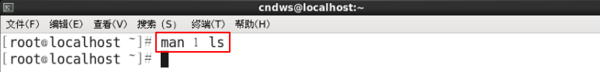

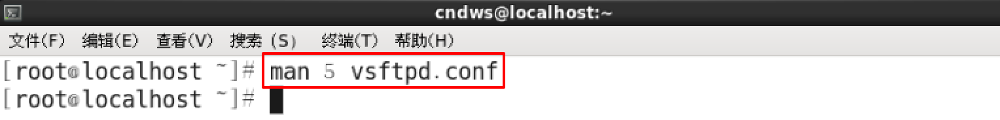

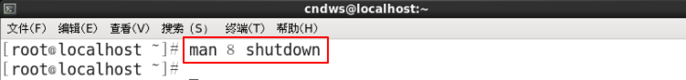

